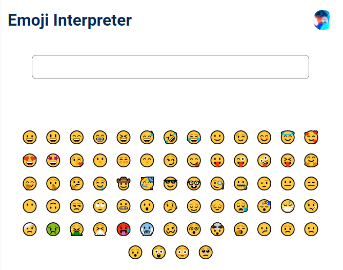

# Emoji Interpreter

## Overview
This is a simple React application that interprets emojis. Users can either click on an emoji from the list to see its meaning or input an emoji into the text box.
This is my first React application and I'm excited to share it with you!

## Features
- **Emoji Input**: Users can input an emoji into the text box to see its meaning.
- **Emoji Click**: Users can also click on an emoji from the list to see its meaning.
- **Emoji Not Found**: If the entered emoji is not found in the dictionary, the app will display 'Emoji not found'.

## Installation and Setup
1. Clone the repository to your local machine.
2. Navigate to the project directory.
3. Install the required dependencies using `npm install`.
4. Start the application using `npm start`.

## Dependencies
- React
- CSS

## Contributing
I know my code is lacking most of the features. So pull requests are welcome for the major and minor changes.